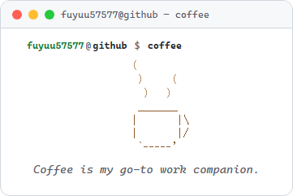
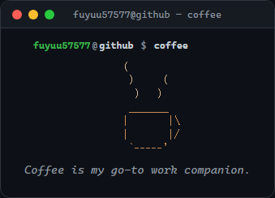
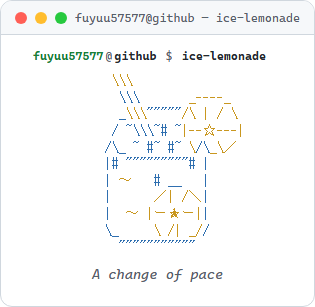
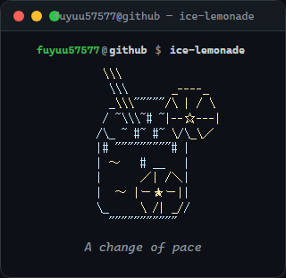
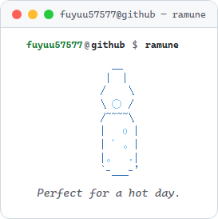
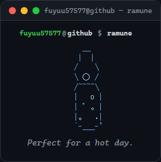

# AA Gallery

A collection of every ASCII-art drink used by the `now` panel (see `assets/AA/*.txt`). Each one renders theme-aware in the profile README — this page just shows them all together. Regenerate with `node tools/build-aa-gallery.mjs` (or `npm run build`, which runs it after `build-readme.mjs`).

### coffee

Coffee is my go-to work companion.

<table>
<tr><th>Light</th><th>Dark</th></tr>
<tr>
<td></td>
<td></td>
</tr>
</table>

### ice-lemonade

A change of pace

<table>
<tr><th>Light</th><th>Dark</th></tr>
<tr>
<td></td>
<td></td>
</tr>
</table>

### ramune

Perfect for a hot day.

<table>
<tr><th>Light</th><th>Dark</th></tr>
<tr>
<td></td>
<td></td>
</tr>
</table>
